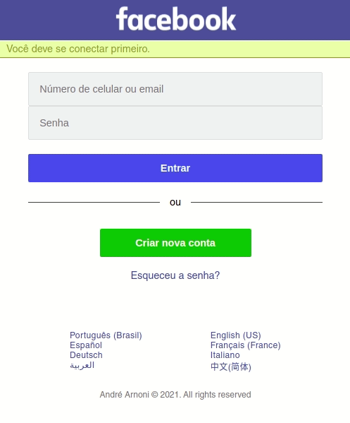

  

<h1 align="center">Facebook Page Old Version</h1>

This page simulates the login Facebook page old version. Designed in responsive mode.

## Demo

Try this project: https://just-for-study.vercel.app/ 

Desktop demo:

  

Mobile demo: 

  

 

## Used Technologies

* JAVASCRIPT
* HTML
* CSS

## Features

* Simulates a Login Facebook Page (old version)
* Fill the form fields like email, password, firstname etc.
* Inactive links to change the language and other preferences.
* Responsive mode

## To Run Locally

Clone the project

`git clone https://github.com/andrearnoni/facebook-page-old-version.git`

Go to the project directory

`cd facebook-page-old-version`

- OBS: You do not need to install any dependencies

Start the server

- OBS: Usually I use the Live Server extension for Vs Code, but you can run the way you prefer

## Authors

This project was coded by [@andrearnoni](https://github.com/andrearnoni) and [@alanctnk](https://github.com/alanctnk). It was designed by [@andrearnoni](https://github.com/andrearnoni).

### Go to my [Portfolio!](https://andrearnoni.vercel.app/) 
### Connect with me at [LinkedIn!](https://www.linkedin.com/in/andrearnoni/) 